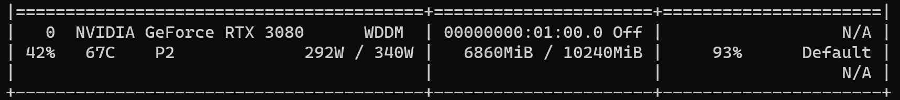
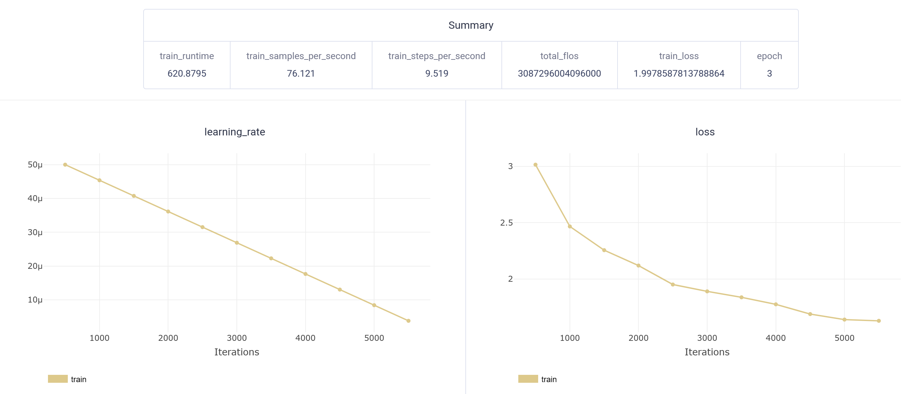
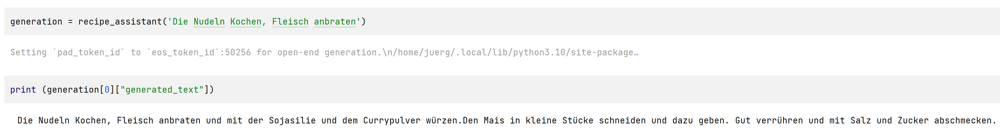

# Source code for the JavaSpektrum article in 04/2023

## Training a small GPT-2 model on a consumer GPU with MLOps operation on ClearML

### Consumer GPU

### ClearML results after training

### Recipe generation example with a small generative LLM (GPT-2)

